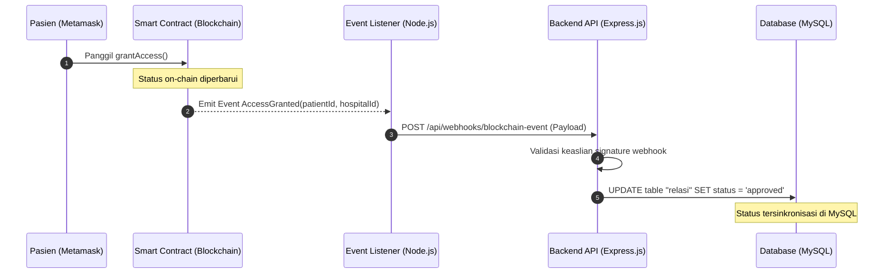

# Arsitektur Sistem Hybrid SatuData (Web3 & SATUSEHAT)

Dokumen ini menjelaskan arsitektur sistem **SatuData**, sebuah platform manajemen rekam medis digital berbasis hybrid yang menggabungkan keandalan **Teknologi Blockchain (Web3)** dengan standar pertukaran data kesehatan nasional **SATUSEHAT (Kemenkes RI v2.5)** serta penyimpanan **Database Terenkripsi (Off-Chain)**.

---

## 1. Ikhtisar Arsitektur (Architecture Overview)

SatuData menerapkan pendekatan **Hybrid Architecture** untuk menyelesaikan tantangan privasi data kesehatan (HIPAA/UU PDP) dan keterbatasan ruang simpan blockchain (*storage cost* & *gas fee*):
1.  **On-Chain (Blockchain)**: Digunakan khusus untuk **Kontrol Akses (Consent)**, **Audit Trail permanen**, dan **Verifikasi Integritas Data** (menyimpan hash data medis).
2.  **Off-Chain (Database Relasional)**: Digunakan untuk menyimpan rekam medis terperinci yang **dienkripsi secara ketat** menggunakan algoritma **AES-256** pada server backend, sehingga ukuran data yang besar tidak membebani blockchain.

```
                  +-----------------------------------+
                  |      Frontend (Next.js App)       |
                  +-----------------------------------+
                       /                         \
        (Web3 Transactions /                      (REST API Calls /
        Consent Management)                        Encrypted Data)
                     /                             \
                    v                               v
       +-----------------------+          +-----------------------+
       |   Blockchain Layer    |          |     Backend API       |
       |    (Smart Contract)   |<-------->|    (Express.js)       |
       +-----------------------+  Verify  +-----------------------+
                                  Consent             |
                                                      v
                                          +-----------------------+
                                          |   Off-Chain Storage   |
                                          |   (MySQL Terenkripsi) |
                                          +-----------------------+
```

---

## 2. Lapisan Arsitektur (Architecture Layers)

### A. Presentation Layer (Frontend - Next.js)
Frontend dibangun menggunakan **Next.js (App Router)** dan **Tailwind CSS v4** untuk menyajikan antarmuka pengguna yang premium, cepat, dan responsif.
*   **Web3 Integration**: Menggunakan **Wagmi** dan **Viem** untuk berinteraksi dengan MetaMask.
*   **State & Cache Management**: Menggunakan **TanStack React Query** untuk manajemen data asinkronus dan caching API.
*   **Role-Based Layout**: Antarmuka terbagi menjadi dashboard khusus untuk **Pasien**, **Rumah Sakit (Faskes)**, dan **Admin** melalui Next.js dynamic routing.

### B. Business Logic Layer (Backend API - Express.js)
Backend dibangun menggunakan **Express.js (Node.js)** sebagai jembatan logika bisnis off-chain.
*   **ORM**: Menggunakan **Sequelize** untuk pemetaan dan manipulasi basis data MySQL.
*   **Security & Auth**: Menerapkan JWT (JSON Web Token), Refresh Token, Helmet, CORS, dan Express Rate Limit untuk ketahanan API.
*   **Web3 Middleware**: Melakukan verifikasi tanda tangan kriptografi (*wallet signature verification*) menggunakan `ethers.js` untuk memastikan keabsahan akun pengguna yang menghubungkan wallet MetaMask.

### C. Blockchain Layer (On-Chain Trust)
Kontrol desentralisasi dikelola melalui Smart Contract Solidity yang dideploy ke EVM-compatible network (diuji via Hardhat).
*   **Smart Contract**: [SatuDataAccessControl.sol](file:///c:/Xampp/htdocs/SatuData/bc-satudata/contracts/SatuDataAccessControl.sol)
*   **Tugas Utama**:
    *   Mencatat permohonan izin dari Faskes secara publik dan transparan (`requestAccess`).
    *   Menyimpan status perizinan secara on-chain (`grantAccess`, `rejectAccess`, `revokeAccess`).
    *   Menyimpan tautan referensi data medis berupa hash kriptografi yang aman.
    *   Memicu Event Log Kriptografis untuk pencatatan riwayat audit (*audit trail*) permanen yang tidak dapat dimanipulasi (*tamper-proof*).

### D. Data Storage Layer (Off-Chain - MySQL)
*   **Database**: MySQL (dijalankan di lingkungan XAMPP untuk pengembangan lokal).
*   **Kondisi Data**: Semua rekam medis sensitif (Penyakit, Laboratorium, Radiologi, Resep, Lampiran) disimpan dalam bentuk chipertext (terenkripsi) agar terhindar dari kebocoran data jika server database diretas.

---

## 3. Sistem Keamanan & Kriptografi Data

### A. Enkripsi Rekam Medis (AES-256)
SatuData menerapkan enkripsi end-to-end (pada level server/klien) menggunakan algoritma **AES-256-CBC**:
1.  **Penurunan Kunci (Key Derivation)**: Kunci enkripsi/dekripsi diturunkan dari *signature signature* (`personal_sign`) MetaMask milik pasien. Tanpa tanda tangan kriptografis dari wallet pasien, backend tidak dapat mendekripsi rekap medis pasien.
2.  **Penyimpanan Kunci**: Backend tidak pernah menyimpan kunci enkripsi pasien secara permanen. Kunci hanya ditransfer secara aman dalam sesi terenkripsi untuk membaca/menulis data.

### B. Dual-Verification Access Control (On-Chain + Off-Chain)
Sebelum Faskes dapat membaca data medis pasien, backend SatuData melakukan verifikasi ganda:
1.  **Langkah 1 (On-Chain)**: Backend memanggil fungsi `verifyAccess(patientId, hospitalId)` di Smart Contract untuk memeriksa apakah pasien telah menyetujui akses ke Faskes tersebut di blockchain.
2.  **Langkah 2 (Off-Chain)**: Backend memverifikasi validitas JWT token Faskes dan mencocokkannya dengan database MySQL untuk memastikan tidak ada pemalsuan identitas (*identity theft*).

---

## 4. Sinkronisasi Event Blockchain (Event Streamer)

Untuk mengoptimalkan performa dan menghindari latensi pembacaan data langsung dari blockchain pada setiap request API, SatuData menggunakan pola **Event-Driven Synchronization**:



---

## 5. Integrasi SATUSEHAT Kemenkes RI v2.5

SatuData dirancang selaras dengan regulasi nasional Indonesia tentang Satu Sehat:
*   **Interoperabilitas Standar FHIR**: Struktur data rekam medis dienkapsulasi menggunakan skema standar FHIR JSON (Fast Healthcare Interoperability Resources) agar kompatibel dengan ekosistem SATUSEHAT Kemenkes RI.
*   **Identitas Unik**: Pemetaan pasien didukung oleh Nomor Induk Kependudukan (NIK) yang terintegrasi dengan data kependudukan nasional untuk proses query pencarian pasien secara aman.
*   **Keamanan Terpadu**: Kombinasi kerangka kerja keamanan Web3 (MetaMask) bertindak sebagai otentikasi lapis kedua di atas gateway SATUSEHAT.
