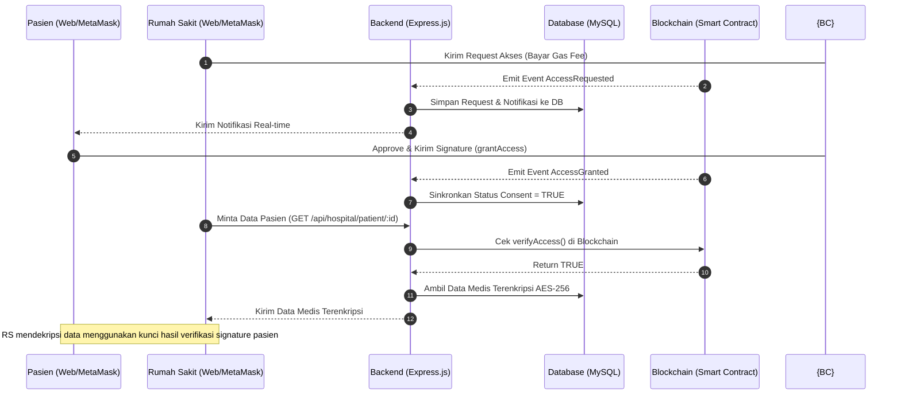

# Dokumentasi Modul Aplikasi SatuData

SatuData adalah platform manajemen rekam medis berbasis blockchain yang memberikan hak kontrol penuh (consent) kepada pasien atas data kesehatan mereka. Sistem ini menggabungkan penyimpanan off-chain terenkripsi (MySQL) dengan kontrol akses terdesentralisasi on-chain (Smart Contract Solidity).

Berikut adalah rincian modul-modul yang ada di dalam aplikasi **SatuData**:

---

## 1. Modul Autentikasi & Integrasi Wallet (Auth Module)
Modul ini menangani pengelolaan identitas pengguna baik secara konvensional (Web2) maupun terdesentralisasi (Web3).
*   **Registrasi & Login Akun**: Pendaftaran dan masuk log menggunakan email dan password untuk peran Pasien dan Rumah Sakit/Faskes.
*   **Verifikasi Email & Aktivasi**: Pengiriman email aktivasi setelah registrasi untuk memastikan email pengguna valid.
*   **Lupa & Reset Password**: Mekanisme pemulihan akun melalui token yang dikirimkan ke email.
*   **Hubungkan Wallet (Web3 Connection)**: Integrasi dengan MetaMask menggunakan pustaka Wagmi/Viem pada frontend dan Ethers.js pada backend.
*   **Tautan Wallet & Tanda Tangan**: Proses mengaitkan *wallet address* ke akun pengguna melalui verifikasi tanda tangan (*signature verification*) berbasis kode acak (*nonce*) untuk mencegah serangan *replay attack*.

---

## 2. Modul Pasien (Patient Portal & Consent Manager)
Modul utama yang digunakan oleh pasien untuk mengontrol penuh data rekam medis mereka sendiri.
*   **Manajemen Profil**: Melihat dan memperbarui data profil pasien (termasuk foto profil).
*   **Consent Manager Panel**: Panel kontrol untuk mengelola izin akses data rekam medis. Pasien dapat:
    *   Melihat daftar permohonan akses dari berbagai Rumah Sakit.
    *   Memberikan persetujuan akses secara on-chain (*Approve/Grant Access*).
    *   Menolak permohonan akses (*Reject Access*).
    *   Mencabut izin akses yang sedang aktif secara instan kapan saja (*Revoke Access*).
*   **Timeline Riwayat Medis**: Menampilkan riwayat medis pasien secara kronologis (data didekripsi di sisi klien menggunakan kunci yang diturunkan dari signature wallet pasien).
*   **Audit Trail Pasien**: Riwayat pelacakan mendetail mengenai siapa saja (Rumah Sakit/Dokter mana) yang telah mengakses atau memperbarui data medis mereka, kapan, dan untuk tujuan apa.

---

## 3. Modul Rumah Sakit / Faskes (Hospital Portal & Medical Record Manager)
Modul yang digunakan oleh institusi kesehatan terverifikasi untuk mengajukan izin akses dan mengelola rekam medis pasien.
*   **Manajemen Profil Rumah Sakit**: Melihat dan memperbarui profil institusi (logo, nama faskes, alamat, dll.).
*   **Request Access Form**: Fitur untuk mengajukan permohonan akses data medis pasien tertentu dengan memasukkan ID Pasien / wallet address pasien, jenis data yang dibutuhkan (Umum, Laboratorium, Radiologi), dan tujuan permohonan. Transaksi ini ditulis ke blockchain (RS menanggung *gas fee*).
*   **Upload Rekam Medis**: Mengunggah rekam medis baru untuk pasien (tipe data Umum, Lab, Radiologi, Resep Obat, Lampiran File) setelah mendapatkan izin tulis (*write access*) dari pasien.
*   **Patient Data Viewer**: Menampilkan data medis pasien secara lengkap selama izin akses yang diberikan oleh pasien masih aktif.
*   **Riwayat Unggahan**: Menampilkan daftar rekam medis yang pernah diunggah oleh Rumah Sakit tersebut.
*   **Audit Trail Rumah Sakit**: Log aktivitas internal rumah sakit demi kepatuhan regulasi kesehatan.

---

## 4. Modul Manajemen Dokter (Doctor Management)
Sub-modul di bawah pengelolaan Rumah Sakit untuk mengatur tenaga medis mereka.
*   **Tambah/Edit/Hapus Dokter**: Rumah Sakit dapat mendaftarkan akun dokter, mengunggah foto, menentukan spesialisasi, dan mengelola status aktif mereka.
*   **Daftar Dokter**: Menampilkan daftar dokter yang bernaung di bawah Rumah Sakit terkait untuk mempermudah penugasan penulisan rekam medis.

---

## 5. Modul Administrator & Monitoring (Admin Portal)
Modul pengawasan sistem global yang digunakan oleh administrator SatuData.
*   **Verifikasi & Validasi Faskes**: Memvalidasi pendaftaran Rumah Sakit baru untuk memastikan kredibilitas institusi medis sebelum mereka dapat menggunakan sistem.
*   **Manajemen Pengguna**: Memantau seluruh akun (Pasien, Rumah Sakit, Admin), melakukan aktivasi paksa (*force activate*), mengirim ulang email aktivasi, atau menonaktifkan akun yang melanggar ketentuan (*deactivate*).
*   **Dashboard Monitoring**: Menampilkan metrik statistik global (jumlah pasien, rumah sakit terdaftar, aktivitas transaksi on-chain, dll.).
*   **Global Audit Log**: Log pengawasan menyeluruh terhadap aktivitas sistem untuk mendeteksi potensi penyalahgunaan atau akses ilegal ke data kesehatan.

---

## 6. Modul Blockchain & Kontrol Akses (Smart Contract Layer)
Lapisan desentralisasi yang bertindak sebagai *source of truth* untuk izin akses medis.
*   **Smart Contract (`SatuDataAccessControl.sol`)**:
    *   `requestAccess()`: Faskes mendaftarkan permintaan akses ke blockchain.
    *   `grantAccess()`: Pasien menyetujui izin akses dan mengaitkan IPFS hash terenkripsi dari data rekam medis.
    *   `rejectAccess()` / `revokeAccess()`: Pasien menolak atau mencabut hak akses secara on-chain.
    *   `verifyAccess()`: Memvalidasi apakah hak akses Faskes ke data pasien tertentu masih aktif.
    *   `getRecordHash()`: Mengambil hash rekam medis terenkripsi (hanya jika hak akses bernilai *true*).
*   **Sinkronisasi Event Blockchain**: Listener backend yang memantau event on-chain (`AccessGranted`, `AccessRevoked`, `AccessRequested`) untuk disinkronkan ke database MySQL via Webhooks, sehingga data off-chain selalu selaras dengan kondisi blockchain.

---

## 7. Modul Enkripsi & Keamanan Data (Security & Encryption Module)
Lapisan pelindung privasi data medis sensitif.
*   **Enkripsi AES-256**: Mengenkripsi seluruh konten rekam medis sensitif (off-chain) sebelum disimpan ke database MySQL agar data tidak dapat dibaca langsung oleh admin database.
*   **Kunci Enkripsi berbasis Signature**: Kunci enkripsi/dekripsi diturunkan langsung dari signature MetaMask pasien, memastikan hanya pemilik kunci (pasien) dan pihak berwenang (Faskes dengan izin aktif) yang dapat mendekripsi data.
*   **Proteksi Keamanan API**: Penerapan JWT Session, Refresh Token, Helmet, Rate Limiter, serta validasi input guna menghindari SQL Injection, Cross-Site Scripting (XSS), dan Replay Attacks.

---

## 8. Modul Notifikasi (Notification Module)
Menjaga komunikasi real-time antar pengguna aplikasi.
*   **Notifikasi Permintaan Akses**: Memberi tahu pasien ketika ada Rumah Sakit yang mengajukan akses rekam medis.
*   **Notifikasi Perubahan Status**: Memberi tahu Rumah Sakit saat pasien menyetujui, menolak, atau mencabut permintaan akses mereka.
*   **Manajemen Notifikasi**: Fitur untuk melihat jumlah notifikasi belum dibaca, menandai telah dibaca (*mark as read*), dan menandai semua dibaca (*mark all as read*).

---

## 9. Modul FAQ & AI Chatbot
Modul edukasi dan interaksi pengguna berbasis Kecerdasan Buatan.
*   **Chatbot Asisten Medis/Sistem**: Membantu pengguna (terutama pasien) menjawab pertanyaan seputar penggunaan aplikasi SatuData, cara kerja blockchain, cara memberikan persetujuan (consent), hingga edukasi kesehatan dasar secara interaktif.

---

## Alur Integrasi Antar Modul (Workflow)

